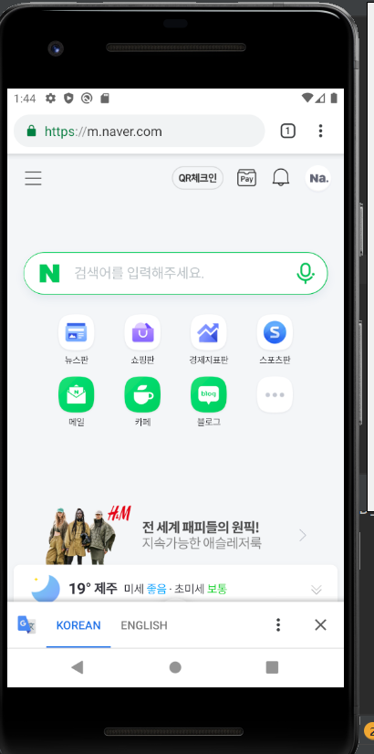

# 20173007_lsa_androidApp
</img>
  
# 2주차
</img>

# 3주차
</img>
</img>

# 4주차
사진이나 키워드로 악세사리를 검색했을 때 비슷한 분위기나 색깔의 악세사리를 추천해주는 앱

# 5주차
</img>
</img>

# 6주차
이미지 바꾸기 
</img> </img>
첫번째 이미지 넓이, 높이 
</img> </img>
두번째 이미지 넓이, 높이
</img> </img>

